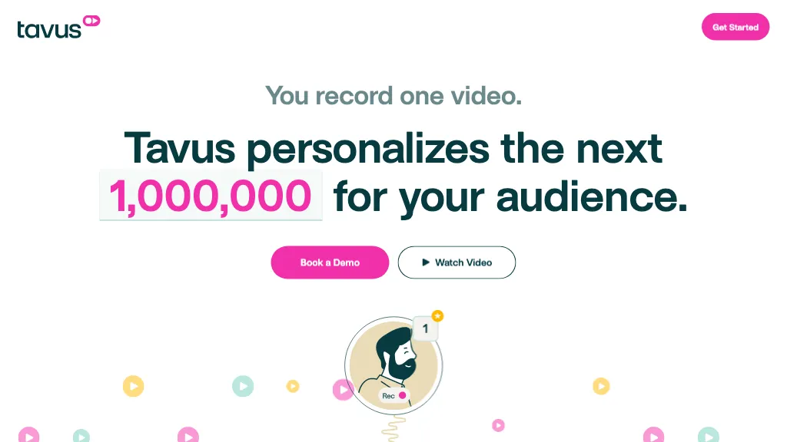

<div align="left">

[](https://www.tavus.io&#x2F;)

# [Tavus](https://www.tavus.io&#x2F;)<a id="tavus"></a>

We're an AI video research company making personalized video possible at scale. Generate videos of yourself, and never record again! Available via web app & developer APIs.

</div>

## Table of Contents<a id="table-of-contents"></a>

<!-- toc -->

- [Installation](#installation)
- [Getting Started](#getting-started)
- [Reference](#reference)
  * [`tavus.replicas.createNewReplica`](#tavusreplicascreatenewreplica)
  * [`tavus.replicas.deleteByReplicaId`](#tavusreplicasdeletebyreplicaid)
  * [`tavus.replicas.getReplicaById`](#tavusreplicasgetreplicabyid)
  * [`tavus.replicas.list`](#tavusreplicaslist)
  * [`tavus.replicas.renameReplicaById`](#tavusreplicasrenamereplicabyid)
  * [`tavus.videos.createVideoFromReplicaAndScript`](#tavusvideoscreatevideofromreplicaandscript)
  * [`tavus.videos.deleteByVideoId`](#tavusvideosdeletebyvideoid)
  * [`tavus.videos.getAll`](#tavusvideosgetall)
  * [`tavus.videos.getByVideoId`](#tavusvideosgetbyvideoid)
  * [`tavus.videos.updateName`](#tavusvideosupdatename)

<!-- tocstop -->

## Installation<a id="installation"></a>
<div align="center">
  <a href="https://konfigthis.com/sdk-sign-up?company=Tavus&language=TypeScript">
    
  </a>
</div>

## Getting Started<a id="getting-started"></a>

```typescript
import { Tavus } from "tavus-typescript-sdk";

const tavus = new Tavus({
  // Defining the base path is optional and defaults to https://tavusapi.com
  // basePath: "https://tavusapi.com",
  apiKey: "API_KEY",
});

const createNewReplicaResponse = await tavus.replicas.createNewReplica({
  train_video_url: "train_video_url_example",
});

console.log(createNewReplicaResponse);
```

## Reference<a id="reference"></a>


### `tavus.replicas.createNewReplica`<a id="tavusreplicascreatenewreplica"></a>

This endpoint creates a new Replica that can be used to generate personalized videos. 

The only required body parameter is `train_video_url`. This url must be a download link such as a presigned S3 url. Please ensure you pass in a video that meets the [requirements](https://docs.tavusapi.com/api-reference) for training.

Replica training will fail without the following consent statement being present at the beginning of the video:
> I, [FULL NAME], am currently speaking and consent Tavus to create an AI clone of me by using the audio and video samples I provide. I understand that this AI clone can be used to create videos that look and sound like me.

Learn more about the consent statement [here](https://docs.tavusapi.com/api-reference).

Learn more about training a personal Replica [here](https://docs.tavusapi.com/api-reference).


#### 🛠️ Usage<a id="🛠️-usage"></a>

```typescript
const createNewReplicaResponse = await tavus.replicas.createNewReplica({
  train_video_url: "train_video_url_example",
});
```

#### ⚙️ Parameters<a id="⚙️-parameters"></a>

##### train_video_url: `string`<a id="train_video_url-string"></a>

A direct link to a publicly accessible storage location such as an S3 bucket. This video will be used for replica training.

##### callback_url: `string`<a id="callback_url-string"></a>

A url that will receive a callback on completion of replica training or on error.

##### replica_name: `string`<a id="replica_name-string"></a>

A name for the replica.

#### 🔄 Return<a id="🔄-return"></a>

[ReplicasCreateNewReplicaResponse](./models/replicas-create-new-replica-response.ts)

#### 🌐 Endpoint<a id="🌐-endpoint"></a>

`/v2/replicas` `POST`

[🔙 **Back to Table of Contents**](#table-of-contents)

---


### `tavus.replicas.deleteByReplicaId`<a id="tavusreplicasdeletebyreplicaid"></a>

This endpoint deletes a single Replica by its unique identifier. Once deleted, this Replica can not be used to generate videos.


#### 🛠️ Usage<a id="🛠️-usage"></a>

```typescript
const deleteByReplicaIdResponse = await tavus.replicas.deleteByReplicaId({});
```

#### ⚙️ Parameters<a id="⚙️-parameters"></a>

##### replicaId: `string`<a id="replicaid-string"></a>

#### 🌐 Endpoint<a id="🌐-endpoint"></a>

`/v2/replicas/{replica_id}` `DELETE`

[🔙 **Back to Table of Contents**](#table-of-contents)

---


### `tavus.replicas.getReplicaById`<a id="tavusreplicasgetreplicabyid"></a>

This endpoint returns a single Replica by its unique identifier. 

Included in the response body is a `training_progress` string that represents the progress of the Replica training. If there are any errors during training, the `status` will be `error` and the `error_message` will be populated.


#### 🛠️ Usage<a id="🛠️-usage"></a>

```typescript
const getReplicaByIdResponse = await tavus.replicas.getReplicaById({});
```

#### ⚙️ Parameters<a id="⚙️-parameters"></a>

##### replicaId: `string`<a id="replicaid-string"></a>

#### 🔄 Return<a id="🔄-return"></a>

[ReplicasGetReplicaByIdResponse](./models/replicas-get-replica-by-id-response.ts)

#### 🌐 Endpoint<a id="🌐-endpoint"></a>

`/v2/replicas/{replica_id}` `GET`

[🔙 **Back to Table of Contents**](#table-of-contents)

---


### `tavus.replicas.list`<a id="tavusreplicaslist"></a>

This endpoint returns a list of all replicas that have been created by the API Key in use. In the response, a root level `data` key will contain the list of Replicas.


#### 🛠️ Usage<a id="🛠️-usage"></a>

```typescript
const listResponse = await tavus.replicas.list();
```

#### 🔄 Return<a id="🔄-return"></a>

[ReplicasListResponse](./models/replicas-list-response.ts)

#### 🌐 Endpoint<a id="🌐-endpoint"></a>

`/v2/replicas` `GET`

[🔙 **Back to Table of Contents**](#table-of-contents)

---


### `tavus.replicas.renameReplicaById`<a id="tavusreplicasrenamereplicabyid"></a>

This endpoint renames a single Replica by its unique identifier. 


#### 🛠️ Usage<a id="🛠️-usage"></a>

```typescript
const renameReplicaByIdResponse = await tavus.replicas.renameReplicaById({
  replica_name: "replica_name_example",
});
```

#### ⚙️ Parameters<a id="⚙️-parameters"></a>

##### replica_name: `string`<a id="replica_name-string"></a>

##### replicaId: `string`<a id="replicaid-string"></a>

#### 🌐 Endpoint<a id="🌐-endpoint"></a>

`/v2/replicas/{replica_id}/name` `PATCH`

[🔙 **Back to Table of Contents**](#table-of-contents)

---


### `tavus.videos.createVideoFromReplicaAndScript`<a id="tavusvideoscreatevideofromreplicaandscript"></a>

This endpoint generates a new video using a Replica and a script. 

The only required body parameters are `replica_id` and `script`. The `replica_id` is a unique identifier for the Replica that will be used to generate the video. The `script` is the text that will be spoken by the Replica in the video.

If a `background_url` is provided, Tavus will record a video of the website and use it as the background for the video. If a `background_source_url` is provided, where the URL points to a download link such as a presigned S3 URL, Tavus will use the video as the background for the video. If neither are provided, the video will consist of a full screen Replica.

To learn more about generating videos with Replicas, see [here](https://docs.tavusapi.com/api-reference).

To learn more about writing an effective script for your video, see [Scripting prompting](https://docs.tavusapi.com/api-reference).


#### 🛠️ Usage<a id="🛠️-usage"></a>

```typescript
const createVideoFromReplicaAndScriptResponse =
  await tavus.videos.createVideoFromReplicaAndScript({
    replica_id: "r783537ef5",
    script: "Hello from Tavus! Enjoy your new replica",
    video_name: "My First Video",
  });
```

#### ⚙️ Parameters<a id="⚙️-parameters"></a>

##### replica_id: `string`<a id="replica_id-string"></a>

A unique identifier for the replica that will be used to generate the video.

##### script: `string`<a id="script-string"></a>

A script to be used for the video.

##### background_source_url: `string`<a id="background_source_url-string"></a>

A direct link to a video that is publicly accessible via a storage location such as an S3 bucket. This will be used as the background for the video. The video must be publicly accessible.

##### background_url: `string`<a id="background_url-string"></a>

A link to a website. This will be used as the background for the video. The website must be publicly accessible and properly formed.

##### video_name: `string`<a id="video_name-string"></a>

A name for the video.

#### 🔄 Return<a id="🔄-return"></a>

[VideosCreateVideoFromReplicaAndScriptResponse](./models/videos-create-video-from-replica-and-script-response.ts)

#### 🌐 Endpoint<a id="🌐-endpoint"></a>

`/v2/videos` `POST`

[🔙 **Back to Table of Contents**](#table-of-contents)

---


### `tavus.videos.deleteByVideoId`<a id="tavusvideosdeletebyvideoid"></a>

This endpoint deletes a single video by its unique identifier.


#### 🛠️ Usage<a id="🛠️-usage"></a>

```typescript
const deleteByVideoIdResponse = await tavus.videos.deleteByVideoId({});
```

#### ⚙️ Parameters<a id="⚙️-parameters"></a>

##### videoId: `string`<a id="videoid-string"></a>

#### 🌐 Endpoint<a id="🌐-endpoint"></a>

`/v2/videos/{video_id}` `DELETE`

[🔙 **Back to Table of Contents**](#table-of-contents)

---


### `tavus.videos.getAll`<a id="tavusvideosgetall"></a>

This endpoint returns a list of all videos that have been generated by the API Key in use. 


#### 🛠️ Usage<a id="🛠️-usage"></a>

```typescript
const getAllResponse = await tavus.videos.getAll();
```

#### 🔄 Return<a id="🔄-return"></a>

[VideosGetAllResponse](./models/videos-get-all-response.ts)

#### 🌐 Endpoint<a id="🌐-endpoint"></a>

`/v2/videos` `GET`

[🔙 **Back to Table of Contents**](#table-of-contents)

---


### `tavus.videos.getByVideoId`<a id="tavusvideosgetbyvideoid"></a>

This endpoint returns a single video by its unique identifier. 

The response body will contain a `status` string that represents the status of the video. If the video is ready, the response body will also contain a `download_url`, `stream_url`, and `hosted_url` that can be used to download, stream, and view the video respectively.


#### 🛠️ Usage<a id="🛠️-usage"></a>

```typescript
const getByVideoIdResponse = await tavus.videos.getByVideoId({});
```

#### ⚙️ Parameters<a id="⚙️-parameters"></a>

##### videoId: `string`<a id="videoid-string"></a>

#### 🔄 Return<a id="🔄-return"></a>

[VideosGetByVideoIdResponse](./models/videos-get-by-video-id-response.ts)

#### 🌐 Endpoint<a id="🌐-endpoint"></a>

`/v2/videos/{video_id}` `GET`

[🔙 **Back to Table of Contents**](#table-of-contents)

---


### `tavus.videos.updateName`<a id="tavusvideosupdatename"></a>

This endpoint renames a single video by its unique identifier.


#### 🛠️ Usage<a id="🛠️-usage"></a>

```typescript
const updateNameResponse = await tavus.videos.updateName({
  video_name: "video_name_example",
});
```

#### ⚙️ Parameters<a id="⚙️-parameters"></a>

##### video_name: `string`<a id="video_name-string"></a>

##### videoId: `string`<a id="videoid-string"></a>

#### 🌐 Endpoint<a id="🌐-endpoint"></a>

`/v2/videos/{video_id}/name` `PATCH`

[🔙 **Back to Table of Contents**](#table-of-contents)

---


## Author<a id="author"></a>
This TypeScript package is automatically generated by [Konfig](https://konfigthis.com)
